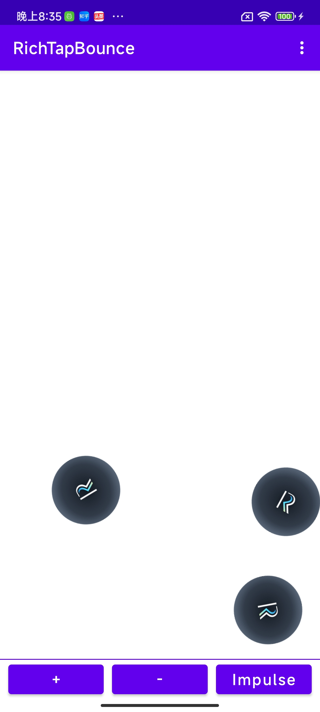

This sample project demonstrates playing haptic effects when there's a collision in physics world. The vibration amplitude is dynamically calculated based on the velocity of the ball.

本示例演示了在物理碰撞的场景下使用RichTap SDK（lite版）播放振动效果，并且依据碰撞时物理的速度动态调整振动的强度。

